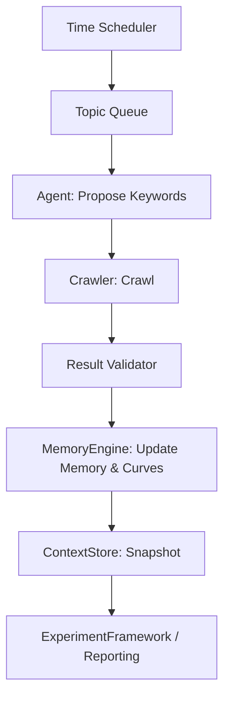
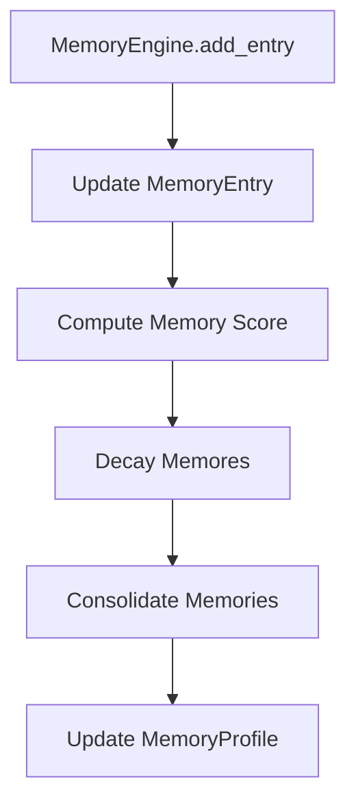
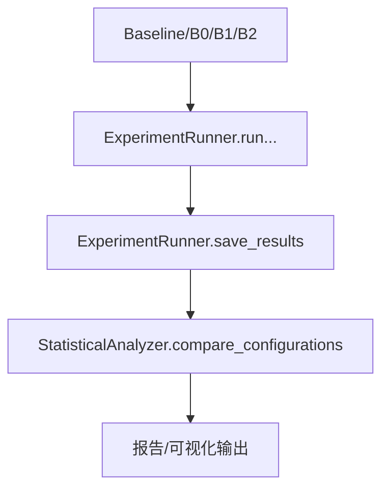

# Interview Hunter Crawling Orchestration 与 记忆驱动的关键字扩展 - 详细流程

发布日期：2024-01-15

---

## 0. 设计原则与目标
- 目标导向：通过记忆驱动的关键词扩展实现高质量爬取与持续覆盖，确保可重复性、可追溯性与可评估性。
- 稳健性：采用定时触发与记忆驱动双轨触发，记忆与爬取形成闭环反馈。
- 可扩展性：暴露清晰接口，便于替换实现、替换数据源、替换检索路径。
- 流程表示：使用 ASCII/ Mermaid 流程图，便于对接与版本对比。

---

## 1. 定时触发与触发源（Triggering & Throttling）
- 设计目标：实现时间触发与记忆驱动触发的双轨并行，降低单点依赖。
- 触发类型
  - 时间触发（Time-based）：按主题轮询、cron 风格调度、日内分段触发。可配置主题优先级与爬取深度。
  - 记忆驱动触发（Memory-driven）：基于记忆曲线的阈值触发附加爬取，例如当 topic_importance 上升、weak_tags 覆盖率下降、recency/frequency 达到阈值时发起爬取。
- 调度策略
  - 对每个主题计算 next_run_time，组合记忆状态、时段偏好和历史爬取频率，加入 jitter，避免全局并发。
  - 支持并发 CrawlTask，受限于资源上限（并发爬取上限、并发向量请求等）。
- 关键数据结构
  - CrawlContextSnapshot：描述本轮爬取任务的上下文，如 topic、关键词、调度时间、优先级、深度等。
  - CrawlScheduleRecord：记录触发时间、耗时、结果数据量、失败信息等。
- 关键接口与流程
  - Scheduler.get_due_topics() -> List[CrawlContextSnapshot]
  - Agent.propose_keywords(context_for_topic, memory_state) -> {keywords, depth}
  - Crawler.crawl(keywords, depth) -> CrawlResult
  - MemoryEngine.update_after_crawl(topic, crawl_result)
  - ContextStore.update_context_with_crawl_context(crawl_context)
  - DataContracts.validate_crawl_metadata(...) -> bool
- 时序简述
 1) 启动/周期触发 -> Scheduler 选出 Topic_A、Topic_B
 2) 针对 Topic_A：读取上下文 ContextStore，获取记忆状态
 3) Agent 基于上下文+记忆提出关键词扩展与爬取深度
 4) Crawler 执行，返回结果
 5) 结果进入数据契约校验 -> MemoryEngine 更新记忆曲线 -> ContextStore 记录快照
 6) 进入下一轮计划

### Mermaid 流程图（便于导出）


- 记忆驱动的关键词扩展（Mermaid）
```mermaid
flowchart TD
  A[Context+Memory] --> B[Agent: Propose Keywords]
  B --> C[Keywords Expansion]
  C --> D[Crawler with Expanded Keywords]
  D --> E[MemoryEngine: Update Signals (Recency, Frequency, Weak Tags)]
```

---

## 2. 上下文管理（ContextStore）的触发与支撑
- 角色：将会话维度的上下文数据、触发信息、爬取目标与结果整合成可追溯的输入。
- 关键数据结构
  - ContextSnapshot: snapshot_id, session_id, user_id, context_data, timestamp, version
  - CrawlContext: topic, keywords, scheduled_at, priority, depth_limit, notes
- 触发与回放
  - 每次爬取都生成 ContextSnapshot，支持前向/后向版本迁移与回放。
- 公开接口
  - create_snapshot(context_data) -> ContextSnapshot
  - get_snapshot(snapshot_id) -> ContextSnapshot
  - list_snapshots(session_id) -> List[ContextSnapshot]
  - get_manifest(session_id) -> ContextManifest
  - inject_context(snapshot_id, prompt) -> str
- 与记忆的协同
  - 将记忆状态注入到快照 context_data，以便爬取时可参考历史状态。
- 记账与审计
  - 快照和变更记录作为审计点，方便回溯与合规检查。

---

## 3. MemoryEngine（记忆曲线设计与实现要点）
- 记忆维度：RECENCY、FREQUENCY、DIFFICULTY、FATIGUE、MOOD、TIME_OF_DAY、TOPIC_IMPORTANCE、WEAK_TAGS
- 主要数据结构
  - MemoryEntry: user_id, content_id, content_type, dimensions, timestamp, metadata
  - MemoryProfile: user_id, entries, total_interactions
- 公开接口
  - add_entry(user_id, entry)
  - get_profile(user_id) -> MemoryProfile
  - compute_memory_score(user_id, content_id) -> float
  - decay_memories(user_id, decay_rate=0.1) -> None
  - consolidate_memories(user_id) -> MemoryProfile
- 记忆曲线设计
  - Recency: 指示最近一次访问的时间间隔，指数衰减
  - Frequency: 访问频度，呈现双曲/对数增长到饱和
  - Time_of_day: 日周期性偏好，结合 hour_of_day
  - Weak_tags: 较弱知识点的重点强调，促使爬取覆盖
- 交互设计
  - memory_score 作为排序权重，直接影响爬取目标、关键词扩展与检索排序
- 与其他模块的关系
  - RagManager 的排序分数会受 memory_score 调整
  - DataContracts 对 MemoryEntry 进行校验
- 伪代码：记忆曲线核心公式（简化版本）
```python
memory_score(c) = w1*recency(c) + w2*frequency(c) + w3*difficulty(c) + w4*fatigue(c) + w5*mood(c) + w6*time_of_day(c) + w7*topic_importance(c) + w8*weak_tags(c)
```

---

## 4. RagManager（多路径检索与排序）
- 5 路径：semantic、keyword、recent、company、tags
- RRF 融合：score = Σ weight_i * score(doc, path_i)
- 公开接口
  - add_document(document)
  - retrieve(query, user_id=None, top_k=10) -> List[Dict]
  - set_path_weight(path_name, weight)
  - get_path_weights() -> Dict
  - explain_ranking(query, doc_id) -> Dict
  - update_path_weights(weights) -> None
- 与 MemoryEngine 的耦合
  - 记忆分数影响路径分数，在 semantic/最近路径等上体现优先级
- 数据校验
  - 数据契约对检索结果进行校验与错误处理

---

## 5. DataContracts（数据治理与校验）
- 设计目标：运行时校验、模式迁移、契约注册
- 公开接口
  - DataValidator.validate(data, contract_name) -> bool
  - DataValidator.validate_with_errors(data, contract_name) -> (bool, List[str])
  - DataValidator.register_contract(name, contract)
  - DataValidator.get_contract(name) -> DataContract
  - DataContract fields: name, version, fields, required_fields, validate, migrate
- 设计要点
  - 版本化、向前向后兼容性、错误信息友好
- 与其他模块的关系
  - 所有输入/输出都需经过数据契约校验
  - 迁移脚本确保历史数据的可用性


## 6) ExperimentFramework（实验设计与评估）
- 目标：定义基线/变体、数据生成、统计分析、报告输出
- 公开核心类
  - BaselineFactory、VariantFactory
  - DataGenerator、ExperimentRunner
  - ExperimentMetrics、ExperimentResult
  - StatisticalAnalyzer
- 工作流
  - 产生基线/变体配置 -> 数据生成 -> 多轮实验 -> 统计对比 -> 报告
- 输出
  - 结果对象、报告、可导出 JSON/CSV
- 与其他模块的关系
  - 结果对比直接评估记忆、上下文管理、RAG 的影响


## 7) 流程图（Mermaid 与 ASCII 双版本）

### 7.1 定时触发与工作流（Mermaid）


### 7.2 记忆驱动的关键词扩展（Mermaid）
```mermaid
flowchart TD
  A[Context+Memory] --> B[Agent: Propose Keywords]
  B --> C[Keywords Expansion]
  C --> D[Crawler with Expanded Keywords]
  D --> E[MemoryEngine: Update Signals (Recency, Frequency, Weak Tags)]
```

### 7.3 数据契约校验流程（Mermaid）
```mermaid
flowchart TD
  I[Input Data] --> J[DataValidator.validate(data, contract)]
  J -->|OK| K[Proceed]
  J -->|ERR| L[Report Validation Errors]
```

### 7.4 内存衰减与跨会话合并（Mermaid）


### 7.5 实验数据流与对比流程（Mermaid）


---

## 8) 验收要点与度量
- 功能性、数据一致性、可观测性、可维护性与可扩展性作为验收要点。
- 验收指标包括：端到端流程完整性、契约校验覆盖、基线/变体对比结果、性能基线、文档完整性。

---

## 9) 风险与对策
- 记忆曲线过于复杂导致难以调试
  - 对策：提供简化模式、逐步开启高级维度
- 定时触发与记忆触发冲突
  - 对策：优先级队列、并发控制、边界条件
- 数据迁移兼容性
  - 对策：版本化契约、迁移脚本、回滚机制
- 外部 API 变更
  - 对策：API 版本化、向后兼容、变更日志

---

## 10) 附件与交付物清单
- 代码：Experiment Framework、核心模块、单元测试、集成测试
- 流程图：Mermaid 版本嵌入文档与 Mermaid 文件
- 文档：INTERVIEW_HUNTER_DETAILED_FLOWS（本文件）、INTERVIEW_HUNTER_REPORT.md

---

## 使用说明
- 直接保存为 docs/INTERVIEW_HUNTER_DETAILED_FLOWS.md 即可；如需 Mermaid 转图片，可再导出为 PNG/SVG。
