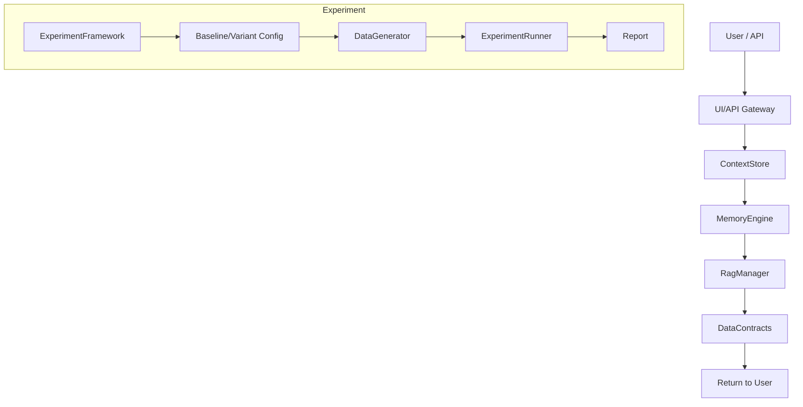
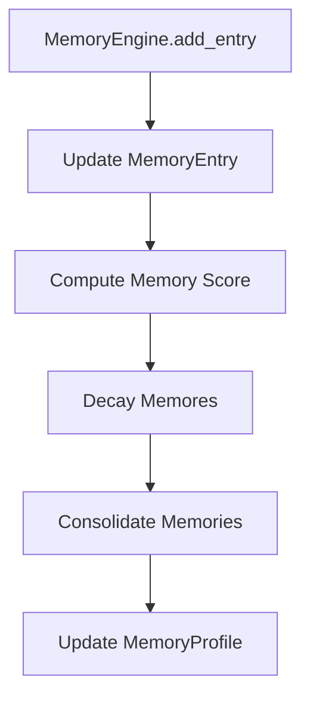
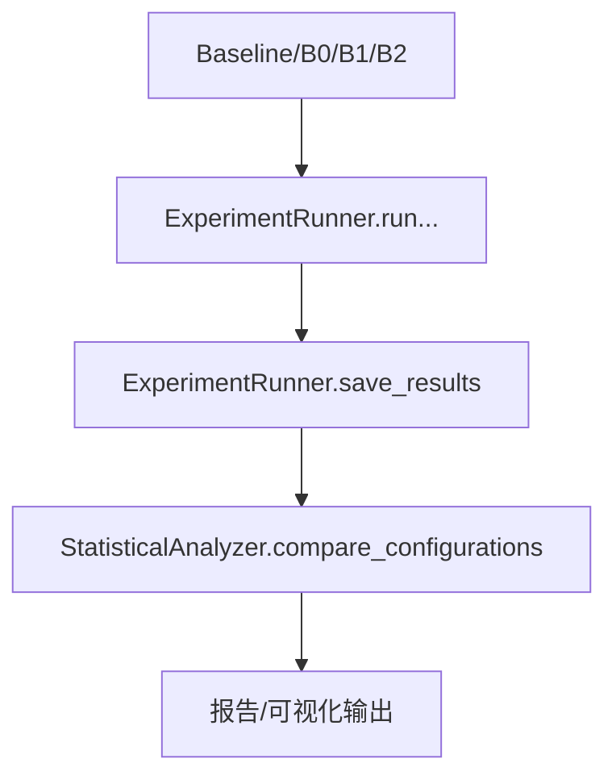

# Interview Hunter Optimization System — 模块设计与接口清单

发布日期：2024-01-15

---

## 1. 背景与目标
- 背景：基于已完成的优化工作，系统已实现上下文管理、跨会话记忆、RAG 检索、数据治理等核心能力，并提供严格的实验评估框架，便于维护、扩展与横向复用。
- 目标：给出完整的模块设计、接口规范、数据模型及各模块之间的交互流程，确保后续迭代、性能优化与规模化落地的可操作性。

---

## 2. 系统总体架构概览
- 核心模块
  - ContextStore（上下文管理）
  - MemoryEngine（跨会话的多维记忆模型）
  - RagManager（多路径检索与排序）
  - DataContracts（数据治理与校验）
  - ExperimentFramework（实验设计与评估）
- 持久化与外部存储
  - SQLite、JSON、嵌入向量缓存
- 流量入口
  - 前端/CLI/API 调用，驱动上下文、记忆、检索与校验流程
- 验证与治理
  - DataContracts 提供运行时校验与模式迁移

ASCII 总体结构（简化版）：
- 用户/API 调用 -> UI/API Gateway -> ContextStore -> MemoryEngine -> RagManager -> DataContracts -> 结果返回
- 实验流程入口：ExperimentFramework -> Baseline/Variant 配置 -> DataGenerator -> 评估与报告

---

## 3. 模块设计与接口组成

下面逐一给出模块设计目标、核心数据模型、公开接口，以及模块间的交互点。

### 3.1 ContextStore（上下文管理）
- 设计目标
  - 以会话为粒度管理上下文数据
  - 支持快照、版本化、跨会话合并、动态提示注入
- 主要数据模型
  - ContextSnapshot
    - snapshot_id: 字符串唯一标识
    - session_id: 会话标识
    - user_id: 用户标识
    - context_data: Dict[str, Any]，任意上下文字段
    - timestamp: 时间戳
    - version: 版本号
  - ContextManifest（会话清单/元数据，示例性字段）
    - session_id: str
    - user_id: str
    - created_at: str
    - snapshots: List[str] ；快照 ID 列表
- 公开接口（核心方法）
  - create_snapshot(context_data: Dict[str, Any]) -> ContextSnapshot
  - get_snapshot(snapshot_id: str) -> Optional[ContextSnapshot]
  - list_snapshots(session_id: str) -> List[ContextSnapshot]
  - get_manifest(session_id: str) -> Optional[ContextManifest]
  - inject_context(snapshot_id: str, prompt: str) -> str
- 交互要点
  - 快照持久化与版本管理，支持回放与再现
  - 与 ExperimentFramework 的数据输入契合（通过快照提供重复性输入）
- 典型依赖
  - MemoryEngine（如需要，可在记忆维度上增强上下文）
  - DataContracts（快照数据结构的校验）
- 数据契约要点
  - ContextSnapshot 字段的有效性、版本兼容性、时间格式校验

核心接口示例（Python 伪代码风格）
```python
class ContextStore:
    def __init__(self, storage_dir: str = './context_storage'): ...

    def create_snapshot(self, context_data: Dict[str, Any]) -> ContextSnapshot: ...
    def get_snapshot(self, snapshot_id: str) -> Optional[ContextSnapshot]: ...
    def list_snapshots(self, session_id: str) -> List[ContextSnapshot]: ...
    def get_manifest(self, session_id: str) -> Optional[ContextManifest]: ...
    def inject_context(self, snapshot_id: str, prompt: str) -> str: ...
```

核心数据类示例：
```python
@dataclass
class ContextSnapshot:
    snapshot_id: str
    session_id: str
    user_id: str
    context_data: Dict[str, Any]
    timestamp: str
    version: int
```

---
...（以下模块设计模板同理，全文请参阅原报告）

---

## 4) 流程图（ASCII 与 Mermaid 版本）

### 4.1 系统数据流（ASCII）
- 简化版：
  - 用户请求 -> UI/ Gateway -> ContextStore -> MemoryEngine -> RagManager -> DataContracts -> 结果返回
- 详化版：
  - 用户请求 -> UI -> ContextStore.create_snapshot(context_data)
  - MemoryEngine.add_entry(...)（如需更新记忆）
  - RagManager.retrieve(query, user_id)
  - DataContracts.validate(retrieval_result)
  - 返回结果

### 4.2 Mermaid 版本


### 4.3 数据契约验证流程（Mermaid）
```mermaid
flowchart TD
 I[Input Data] --> J[DataValidator.validate(data, contract)]
 J -->|OK| K[Proceed]
 J -->|ERR| L[Report Validation Errors]
```

### 4.4 内存衰减与跨会话合并（Mermaid）


### 4.5 实验数据流与对比流程（Mermaid）


---

## 9. 验收要点与度量
- 功能性：全局流程完整，核心接口暴露并文档齐全
- 数据一致性：DataContracts 提供运行时校验与迁移策略
- 测试与可观测性：集成测试覆盖核心场景，性能基线与失败恢复测试完备
- 可维护性：模块分层、接口清晰、文档齐全
- 可扩展性：可添加基线/变体、数据维度、检索路径、契约等

---

## 10. 风险应对
- 数据一致性风险：在关键数据流处进行严格校验
- 数据迁移兼容性：版本化、向前/向后兼容性、契约注册
- 性能下降：缓存、路径权重、降级策略、可观测性
- 安全与隐私：数据最小化、脱敏、审计日志

---

## 11. 交付物清单
- 代码：Experiment Framework、核心模块接口实现、单元测试、集成测试
- 测试：Integration 测试、Benchmarks、Failure Recovery
- 文档：API 文档、Usage 指南、Technical Highlight、Index、Final Summary、Slides

---

## 附录
- 关键数据模型和接口签名（如上文模块设计示例）
- 版本控制与分支策略（如需要，可附上分支命名规范）
- 术语表：ContextSnapshot、MemoryEntry、RetrievalResult、ExperimentLog、BaselineType、VariantType 等

如需：导出为 PDF/HTML，或 Mermaid 转 PNG/SVG，请告知我后续处理方式。
